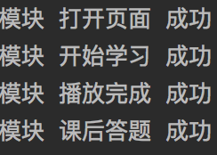

# QNDXX
江苏青年大学习

`代码仅作学习交流使用！`

## 使用方法
1、打开青年大学习页面，抓包获取Cookie值`laravel_session`

2、查看城市代码

| 代码 |  城市名  |
| :--: | :------: |
|  1   |  南京市  |
|  2   |  无锡市  |
|  3   |  徐州市  |
|  4   |  常州市  |
|  5   |  苏州市  |
|  6   |  南通市  |
|  7   | 连云港市 |
|  8   |  淮安市  |
|  9   |  盐城市  |
|  10  |  扬州市  |
|  11  |  镇江市  |
|  12  |  泰州市  |
|  13  |  宿迁市  |

3、填入`main.py`中的`new = Login("laravel_session", "city")`

4、运行脚本

# 运行成功截图

